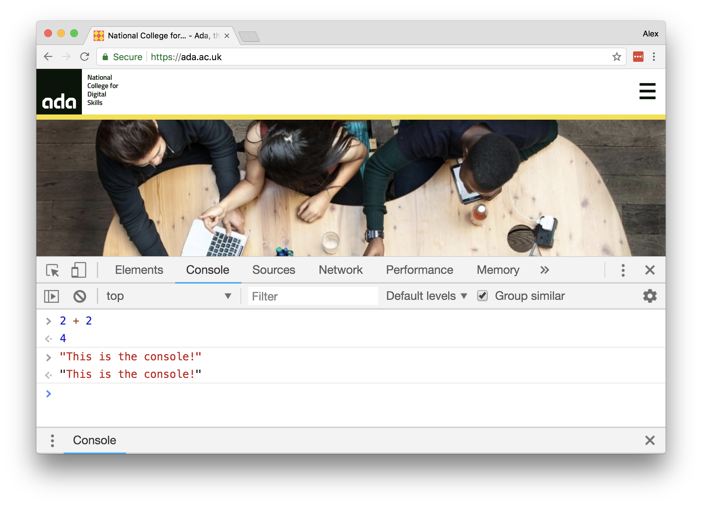

# Workshop 2 - Variables, Data Types, Decisions

You’ll be working in pairs again - **driver/navigator** style, same as before.
Start by forking and cloning the repo - check out the instructions from workshop
1 if you can't remember exactly what you need to do.

Make sure you’ve got the workshop folder open in your editor!

For each of the **bold** questions below:

<h3 align="center">
  🗣 Discuss &nbsp;&nbsp;&nbsp;&nbsp;&nbsp;
  👩‍💻 Change &nbsp;&nbsp;&nbsp;&nbsp;&nbsp;
  👀 Observe &nbsp;&nbsp;&nbsp;&nbsp;&nbsp;
  🔄 Repeat
</h3>

1. **🗣 Discuss** the question with your partner
2. **👩‍💻 Change the code** - what do you expect your changes to do?
3. **👀 Observe the results** - what happened when you ran your code? How did it
   differ from your expectations
4. **🔄 Repeat** - keep discussing, changing, and running the code until you
   feel you understand it

**Remember, it’s about exploration and understanding. Take your time!**

**Don’t move on until you fully understand what’s happening.**

**Explore and have fun! Be curious!**

## Task 1

Open your browser’s JavaScript console - right click anywhere on the page, and
choose ‘Inspect Element’. Then, click ‘Console’ in the bar at the top of the
pane that comes up. This lets you run JavaScript snippets on the web page you’re
currently looking at by typing them at the bottom and pressing enter.



The console allows you to type in single lines of JavaScript. It runs each line,
and tells you the result.

With each of the lines below:

1. read it carefully and make a prediction as to what you think will happen -
   **this is the most important step!**
2. type it into the console and press enter
3. Record the actual result
4. Try to figure out **why**, especially if your guess was incorrect.

Take your time, and feel free to explore and play if something unexpected
happens.

> **Note:** don’t copy-paste! If you copy paste these lines, some of them won’t
> run correctly. Type them out by hand - it’s better practice anyway.

| Line                | Expected Result | Actual Result | Were you right? Why? |
| ------------------- | --------------- | ------------- | -------------------- |
| `2 + 2`             |                 |               |                      |
| `5 - 3`             |                 |               |                      |
| `3 * 6`             |                 |               |                      |
| `10 / 2`            |                 |               |                      |
| `5 / 2`             |                 |               |                      |
| `5.0 / 2`           |                 |               |                      |
| `“hello” + “world”` |                 |               |                      |
| `“Hello” - “world”` |                 |               |                      |
| `3 + “3”`           |                 |               |                      |
| `typeof “hello”`    |                 |               |                      |
| `typeof 13`         |                 |               |                      |
| `typeof true`       |                 |               |                      |
| `typeof 3 + 5`      |                 |               |                      |
| `typeof (3 + 5)`    |                 |               |                      |
| `typeof (3 + “3”)`  |                 |               |                      |
| `3 == 3`            |                 |               |                      |
| `3 == 2`            |                 |               |                      |
| `typeof (3 == 3)`   |                 |               |                      |
| `3 != 3`            |                 |               |                      |
| `3 != 2`            |                 |               |                      |
| `3 == 1 + 2`        |                 |               |                      |
| `3 == 2 + 2`        |                 |               |                      |
| `3 < 2 + 2`         |                 |               |                      |
| `3 > 2 + 2`         |                 |               |                      |

## Task 2

Create a new sketch. Add a folder in this project called `sketch`, and copy the
`index.html` and `sketch.js` from one of your Workshop 1 sketches into the new
folder. Open your sketch in the browser to check it's working, then delete
whatever's in `sketch.js`. Replace it with the following:

```js
function setup() {
  createCanvas(400, 200)
}

function draw() {
  background(100)

  rect(0, 0, 10, 10)
}
```

Go through the code with your partner - what does each line do? You should be
familiar with each from yesterday’s workshop. If you're unsure, go back and
refer to your notes. **Add `// comments` above each line to describe it**

**Add this line to the top of your sketch:**

```js
var position = 100
```

**Replace the rect line with these:**

```js
position = position + 1
rect(position, 0, 10, 10)
```

Run the sketch, and make notes below each of these questions:

1. What happens?
2. Why?
3. What happens if you change 1 to a larger or smaller number?
4. Why?
5. What about a negative number?

Add this line at the bottom of `draw`:

```js
console.log('The position is ' + position)
```

Open up the browser console again (right click -> inspect element -> console)
and see what happens. **Why?**

Add this line at the top of your program. Add your name!

```js
var name = 'your name here'
```

Add this line to `draw`:

```js
text('My name is' + name, 10, 30)
```

**What happens and why? Why isn’t there a space between the word ‘name’ and your
name? Can you add one?**

Add this line to the top of your sketch:

```js
var moving = true
```

Add these lines to your sketch. Make sure it’s outside of `draw` and `setup`

```js
function mousePressed() {
  moving = !moving
}
```

Run your code to make sure it still works. There should be no visible changes.

**Add code to your sketch to show the value of `moving` in `draw`.** Use
`text()` or `console.log`. Try clicking the mouse on the sketch and see what
happens. What’s going on here? How does the content of `mousePressed` work?

Make it so the square stops and starts when you click the mouse. Use the code
below as a starting point:

```js
if (moving) {
  // the code in here only runs if `moving` is true
}
```

**Complete these tasks:**

1. Make the square bounce off the edges of the window
2. Count the number of times the square has bounced, and show it on screen.
   What’s the most appropriate data type for storing the count?

## Task 3

Try and adapt what you've covered so far to make a simple game e.g. Rock Paper
Scissors, One paddle Pong, Tic Tac Toe etc.

**OR**

Do something else! So long as you're writing code and using variables and
`if`/`else` statements
